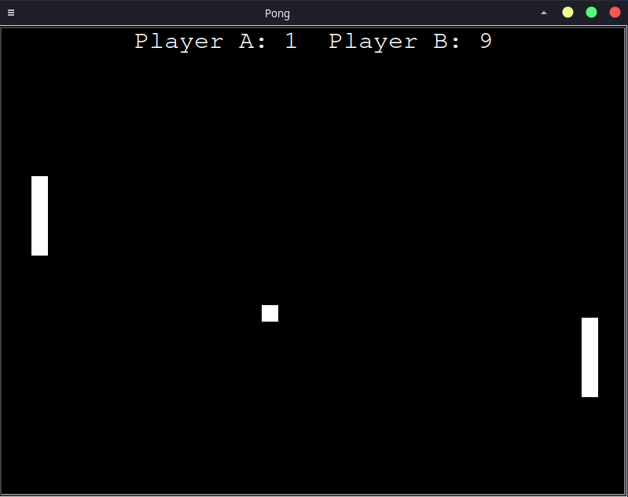
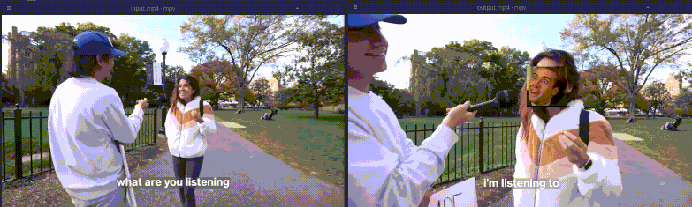

# ChatGPT examples
Some prompts and ChatGPT responses that I found interesting.

## Development
### Pong in Python
Prompt: `Write pong in Python`
Result: 2 player pong game written using turtle library [pong.py](development/pong.py)
It had a small error but it might be due to the fact that I had to write continue multiple times and ChatGPT returned code formatted as code along with code formatted as regular text. Github Copilot fixed the error so in the end I got a working version while writing 0 lines of code.

### Video face replace 
`Write program that finds faces in a video and replaces them and replaces them with a given picture`
Result: Python script that uses `cv2` and `dlib` [face_image_replace.py](development/face_image_replace.py)
This worked out of the box but it produced output file that is many times larger than the input file. 
I don't use these libraries so I'm not sure if this is normal behavior.

### Blur face
`write python code that recognizes and blurs faces in a video file`
Result: This is very similar to the example above so the code is basically the same [blur_face_video.py](development/blur_face_video.py)

## Issues
It seems like it can easily get confused about facts and change its answer if questioned [Minecraft release year](issues/minecraft_year_release.jpg)

It often fails simple math [math fail](issues/chatgpt_math.png) but it corrects itself if I ask it step by step [math correction](issues/chatgpt_math_correction.png).
